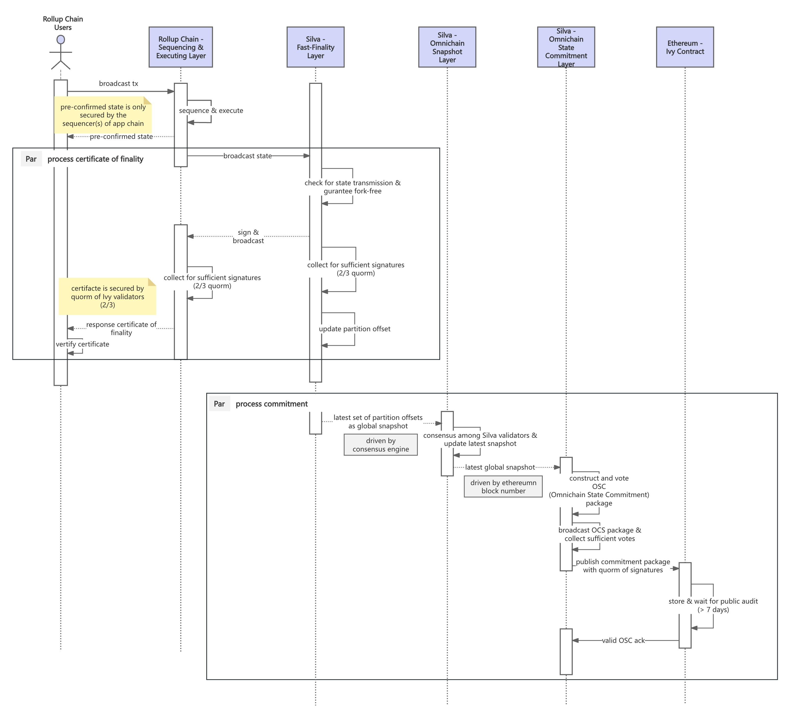

# Layer2 TX Processing Flow

The diagram below illustrates the detailed processing flow of a single transaction from the client to the Silva Network.

Once a transaction is forwarded or submitted, it is packaged into a block by the **sequencing layer of the rollup chain**, while the **finality of the block state** is guaranteed by the **Silva Network**. The block state is finalized in the **Fast Finality Layer**, where it receives a **quorum certificate for state finality**, also referred to as a ***CoF (Certificate of Finality)***. This certificate enables **fast,** **objective, offchain finality confirmation** of the state, typically within seconds (\~1s).

Subsequently, Silva Network’s **Omnichain Snapshot Layer** and **Omnichain State Commitment Layer** work together to generate a final **Omnichain State Commitment Package**, which is published to **Ethereum** for public anchoring and verification. The **Omnichain State Root** included in this package is constructed as a **Merkle Tree** from the finalized states across all partitions during the given period. This Omnichain State Root is then relayed across the entire ecosystem, enabling **omnichain state awareness** and **verifiable interoperability**.