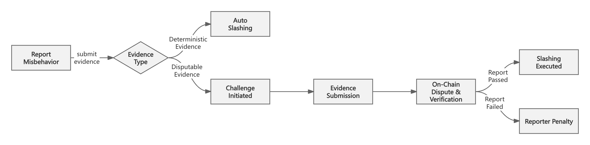

# Fraud Proof: Deterministic & Disputable

The **onchain slashing mechanism** must be actively triggered by sending a transaction on Ethereum to report malicious behavior. Before any slashing is enforced, the system must **prove that the malicious behavior actually occurred which is called fraud proof**.

Based on the type of proof process, Silva categorizes fraud proofs into two types:

* **Deterministic**: The fraud proof provided by the reporter can directly and unequivocally prove that malicious behavior has occurred.  
* **Disputable**: The reporter and the accused must engage in an interactive dispute process on Ethereum, following a predefined set of rules, to determine whether the reported malicious behavior is valid.

Based on the above fraud proof mechanism, we can slash for the following malicious behaviors:

* **Double Voting**: Silva nodes cast multiple inconsistent votes when processing the *CoF* or *OSC*.  
* **Non-Continuous Finality Confirmation for Rollup Chain State**: Silva nodes fail to process the rollup chain state finality verification in strictly increasing order.  
* **Cross-Chain Finality State Omission for Bridged Chain State**: A bridged chain state containing cross-chain transactions was omitted.  
* **Invalid State Transition of Rollup Chain**: A rollup chain state transition that has been finalized by the Silva Network is incorrect, meaning an erroneous state transition was confirmed by Silva.  
* **Invalid State Consensus of Bridged Chain**: A bridged chain state confirmed by the Silva Network has not actually reached finality on its native consensus network. For bridged chains, Silva performs a re-confirmation of finality, i.e., re-validates the finality of states already recognized by the native consensus network of the bridged chain.  
* **Incomplete or Erroneous *OSC (Omnichain State Commitment)* Package**: The omnichain state commitment package published on Ethereum contains incomplete or incorrect data. This ensures the validity and availability of data within the Silva Network.