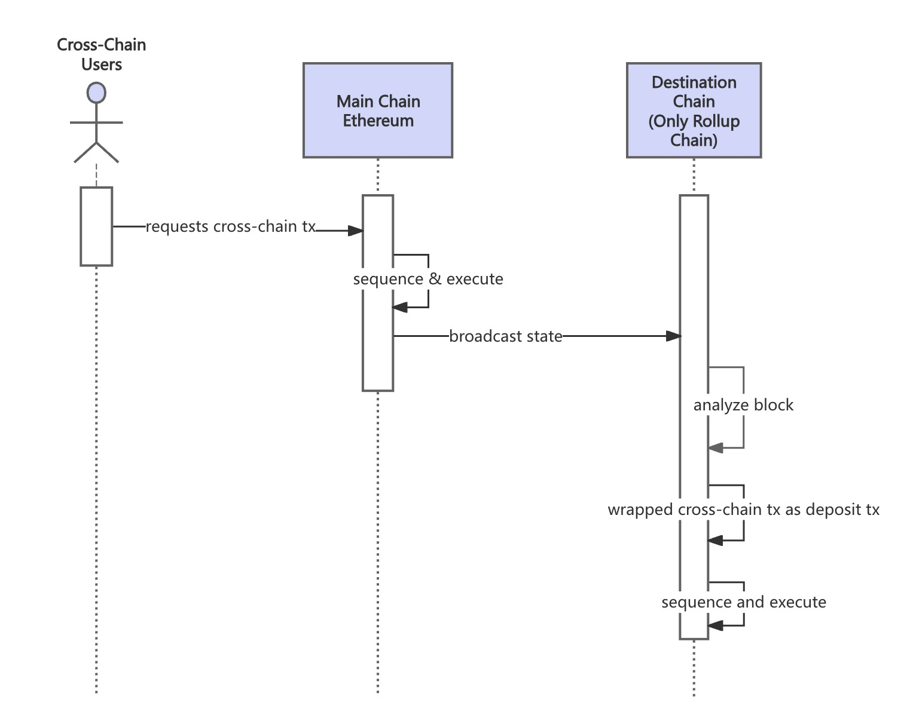
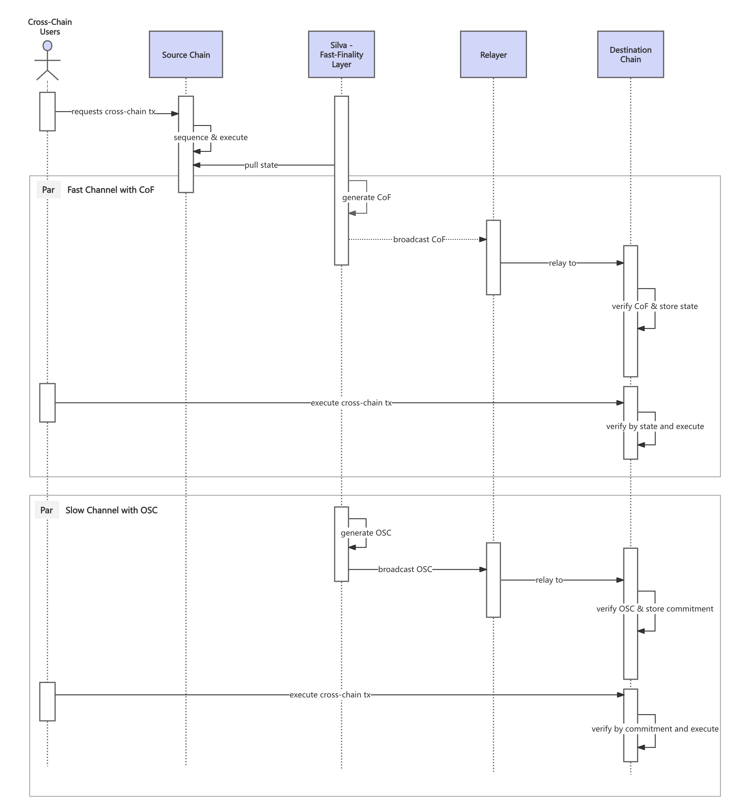

# Cross-Chain Tx Flow

When handling cross-chain events, there is a special case: Main Chain → Rollup Chain. Since rollup chain nodes inherently listen to and parse main chain blocks, they can directly process this type of cross-chain interaction. The processing flow is as follows:

1. A user initiates a cross-chain transaction on the main chain (Ethereum), with the destination chain being a rollup chain.  
2. The main chain packages and executes the transaction.  
3. The sequencer of rollup chain parses the main chain block and directly sequences and executes any *Main Chain → Rollup Chain transactions* related to itself.

    <figure style="display: inline-block; margin: 0;">
        
        <figcaption style="text-align: center; max-width: 1000px; font-weight: bold; font-size: 14px; color: #555;">Cross Chain TX Flow From ETH to Rollups</figcaption>
    </figure>

For other types of cross-chain transactions, the processing flow is as follows:

1. The user initiates a cross-chain transaction request on the **source chain**.  
2. The block state containing cross-chain requests is parsed and processed by the Silva Network.  
3. A ***CoF (Certificate of Finality)*** will be generated for the state in the **Fast Finality Layer**.

**Option 1: If CoF is used for cross-chain interoperability**

1. **Relayer** can choose to relay the *CoF* to the destination chain, where the finality state is validated and stored in a smart contract on the destination chain.  
2. The user constructs a **Merkle Proof** for the cross-chain transaction based on the source chain state and submits it to the destination chain. Upon verification, the cross-chain transaction is executed on the destination chain.

**Option 2: If OSC is used for cross-chain interoperability**

1. The **relayer** waits for the Silva Network to construct a ***OSC (Omnichain State Commitment)*** and relays it to the destination chain.  
2. The user constructs a **Merkle proof** for the cross-chain transaction based on the **commitment** in the *OSC* package and relays it to the destination chain. Upon verification, the cross-chain transaction is executed on the destination chain.

    <figure style="display: inline-block; margin: 0;">
        
        <figcaption style="text-align: center; max-width: 1000px; font-weight: bold; font-size: 14px; color: #555;">Cross Chain TX Flow between Chains</figcaption>
    </figure>

