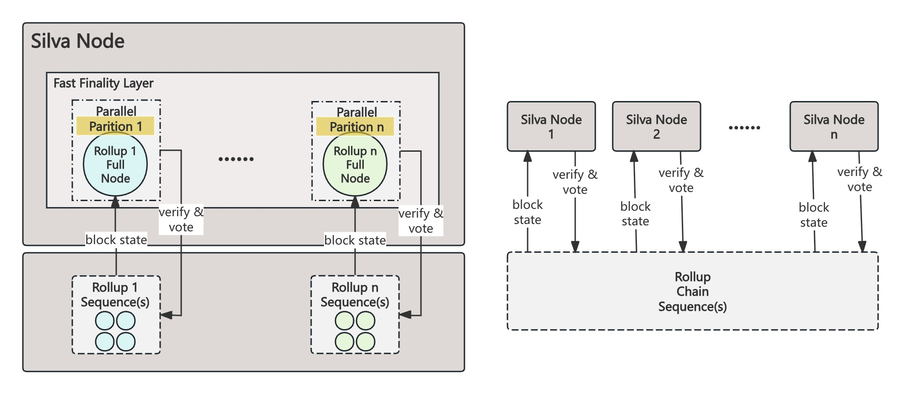

# The Partition Framework and 1-Round Voting Strategy in Fast Finality Layer

    <figure style="display: inline-block; margin: 0;">
        
        <figcaption style="text-align: center; max-width: 1000px; font-weight: bold; font-size: 14px; color: #555;">Parition Framework</figcaption>
    </figure>

To accelerate offchain finality confirmation for rollup chain states as much as possible, Silva Protocol introduces two key optimizations at the **Fast Finality Layer**:

* **Partition Framework for Partition Isolation & Parallel Processing:** For each connected rollup chain (as well as for bridged chain & main chain), Silva constructs an isolated finality confirmation partition. These partitions operate in parallel, significantly improving processing efficiency while also enabling fault isolation—a failure in one partition does not affect the others.  
* **1-Round Voting Strategy for State Finality:** Usually, consensus algorithms require at least two rounds of voting to achieve consistency, resulting in O(n²) message complexity. In contrast, the Silva Network adopts a 1-Round Voting strategy for state finality confirmation, reducing message complexity to O(n).

This **1-Round Voting Strategy** can still guarantee consistent finality results due to the following mechanism:

1. An onchain fraud-proof and slashing system (implemented via Ethereum smart contracts) effectively prevents double voting. That is, producing two conflicting states that both claim finality would require control over at least one-third of the total staked collateral—and any stake associated with the malicious validators would be slashed upon detection.  
2. The Silva Network delegates the responsibility for generating a unique and deterministic state—i.e., sequencing—to the rollup chain’s native sequencing layer. Silva nodes, in turn, are only responsible for verifying state transitions for correctness. As long as no double voting occurs, failures in the rollup’s sequencing layer (such as forks or liveness issues) may delay finality confirmation within that specific partition due to the absence of valid state proposals reaching quorum. However, due to Silva’s partition-level fault isolation, such disruptions are fully contained and do not impact the finality operations of other partitions in the network. In the event of persistent faults or malicious behavior—where the rollup can no longer produce valid blocks—Silva Protocol provides an emergency exit mechanism that ensures users can still securely withdraw their assets from the affected chain.

This architecture is why Silva Protocol functions as a FaaS **(Finality as a Service) protocol**. The SDK we provide for rollup chains supports **both centralized sequencer and decentralized sequencers**, helping mitigate single points of failure and reduce **MEV monopolies**.