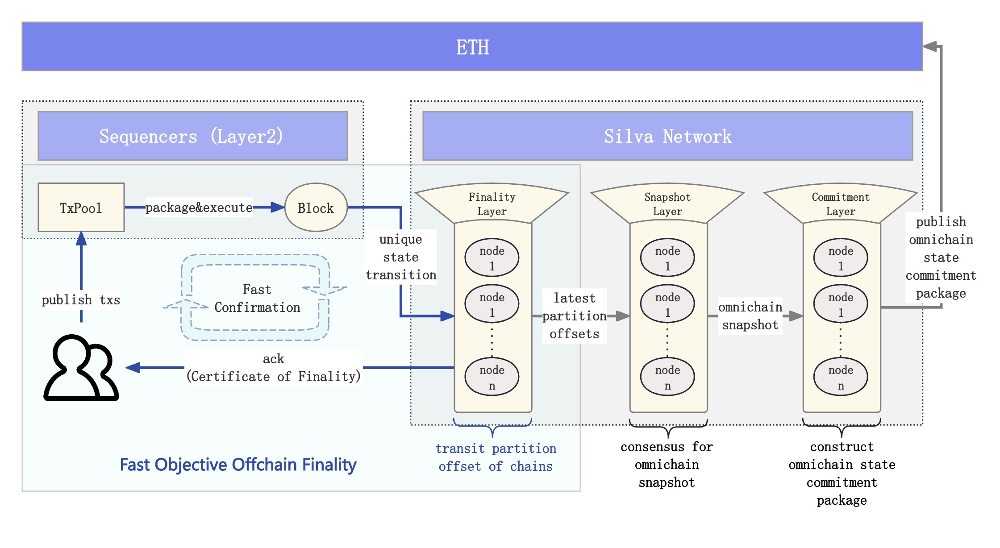

# TLPP (Three-Layers Processing Pipeline) & FOOF (Fast Objective Offchain Finality)

    <figure style="display: inline-block; margin: 0;">
        
        <figcaption style="text-align: center; max-width: 1000px; font-weight: bold; font-size: 14px; color: #555;">Three Layers Processing Pipeline</figcaption>
    </figure>

Silva Protocol supports loosely coupled integration with the sequencing and execution layers of rollup chains. Each rollup chain is required to propose a unique and deterministic block state at every block height and broadcast it to the Silva Network for finality confirmation. The Silva Network processes this through a three-layer architecture:

* **Fast Finality Layer:** At this layer, Silva Network constructs a dedicated finality confirmation partition for each rollup chain, where each partition operates independently and in parallel. The block states of the rollup chains receive ordered finality confirmations here—meaning they are approved by more than 2/3 of the staked validator nodes. Once the voting threshold is met, a *quorum certificate* is generated for the finalized state. This certificate can be relayed to any destination chain, enabling fast and secure cross-chain interoperability.  
* **Omnichain Snapshot Layer:** The latest block height at which a finalized state has been confirmed for each partition is called the Partition Offset. Silva nodes periodically snapshot the Partition Offsets of all partitions and run a consensus process within the Silva Network on the snapshot. This omnichain snapshot layer helps Silva nodes quickly reach a unified omnichain snapshot state.  
* **Omnichain State Commitment Layer:** At this layer, Silva Network periodically (based on Ethereum block height) compiles the most recent snapshot into an *OSC* (Omnichain State Commitment) package, which includes all finalized state information between the previous commitment anchor and the latest snapshot. This package also includes a commitment root built from this data. The *OSC* package will be published to Ethereum, serving as a publicly auditable proof of finalized state progress. At the same time, the commitment root is propagated to all connected chains. By aggregating and compressing omnichain state data, Silva enables low-cost, cross-chain state awareness and interoperability.

Usually, the **Fast Finality Layer** is sufficient to complete the state finality confirmation for rollup chains. The mechanism used at this layer is referred to as **FooF** (Fast Objective Offchain Finality):

* **Fast:** Finality is achieved within seconds latency. The validator committee performs a 1-round voting over the block state (O(n) communication complexity), producing a *CoF (Certificate of Finality)* . The *CoF* along with its associated state, can also be relayed across chains to enable secure cross-chain state awareness.  
* **Objective:** A deterministic and objective fraud proof mechanism is built via Ethereum contracts. This enables Silva to objectively adjudicate misbehaviors at the Fast Finality Layer (e.g., invalid state transitions, double voting, or fork attacks) and apply slashing accordingly.  
* **Offchain:** Usually, the finality confirmation process takes place offchain. Onchain interactions are necessary when cross-chain state awareness or *OSC* anchoring is required.