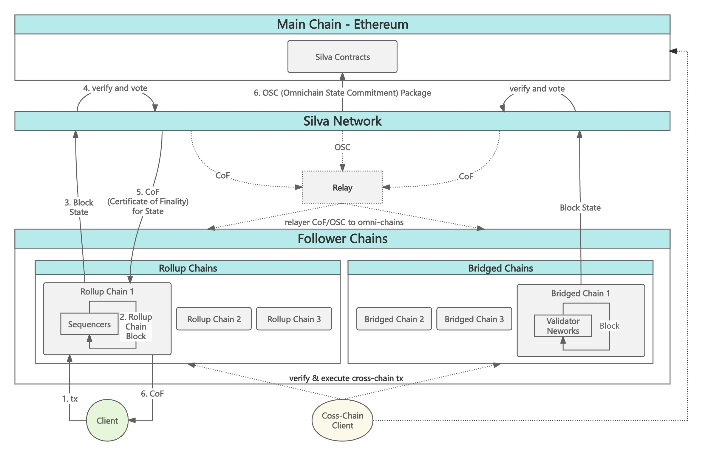

# Global Architecture

Chains that interact with the Silva Network are divided into the following categories:

* **Main Chain:** Typically refers to Ethereum. It serves as the security anchor of the system, managing the Silva Network, omnichain state commitments, supervising behavior, and executing slashing procedures.

* **Follower Chains:** Chains leverage the finality confirmation services of Silva Network are categorized into two types:

  * **Rollup Chains:** The integrated rollup chains (Layer 2\) using Silva services, relying on the Silva Network to achieve fast finality confirmation of state transition and omnichain interoperability.

  * **Bridged Chains:** External existing chains that are bridged to the Silva Network to achieve omnichain interoperability (including Layer 1 such as BSC, as well as Layer 2 of other scalability technology stacks, such as Arbitrum, Optimism, zkSync, etc.) .

The diagram below illustrates how state information from various chains is confirmed and propagated throughout the system:

    <figure style="display: inline-block; margin: 0;">
        
        <figcaption style="text-align: center; max-width: 1000px; font-weight: bold; font-size: 14px; color: #555;">System Structure</figcaption>
    </figure>

The Silva Network continuously issues ***CoF (Certificate of Finality)*** to integrated rollup chains, bridged chains, and the main chain. Based on the *CoF*, clients can quickly confirm the given block state has achieved finality. At the same time, because *CoFs* can be provable onchain across the network, any party can relay *CoFs* (including the associated states) to the destination chain to enable verifiable interoperability.

In addition, the Silva Network periodically aggregates finalized states across chains and constructs a ***Omnichian State Commitment (OSC)*** package. This *OSC* will be published to the main chain for public anchoring and verification, and also relayed to all Follower Chains to establish omnichain state awareness. Since the *OSC* compresses large volumes of states, the cost of verifying and executing a single cross-chain request via *OSC* is significantly reduced.